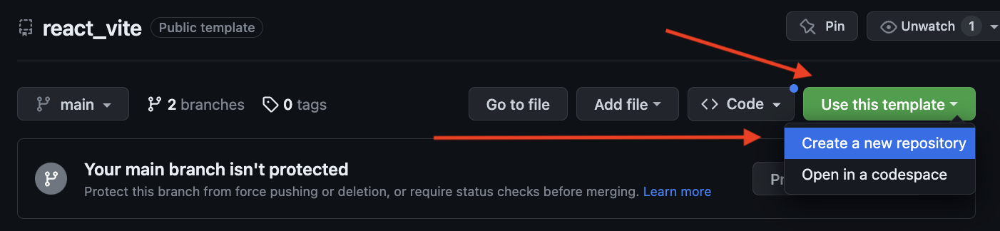
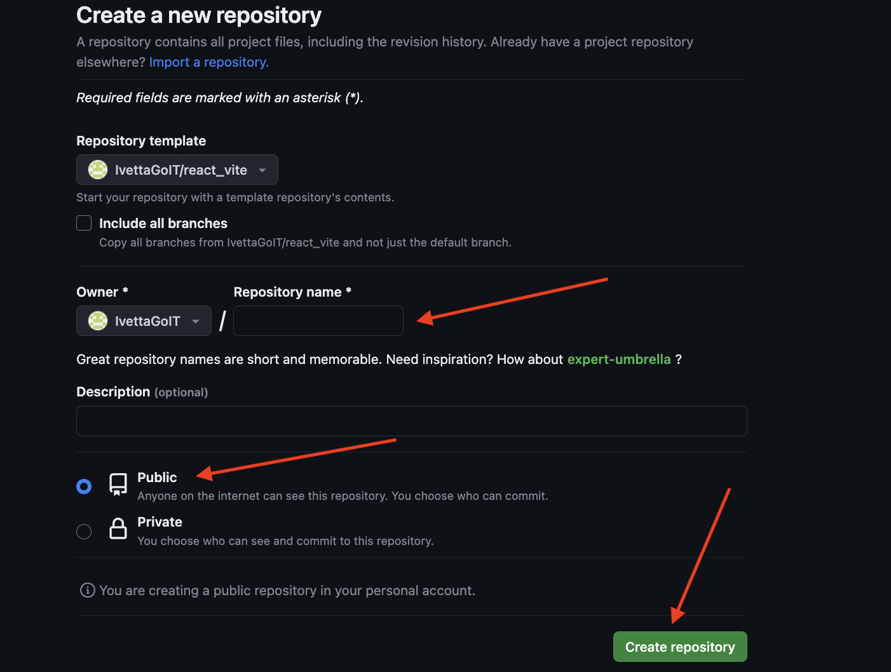

# React + Vite template

Цей проєкт було створено за допомогою [Create Vite](https://vitejs.dev/). Для
знайомства і налаштування додаткових можливостей
[звернися до документації](https://vitejs.dev/guide/).

## Створення репозиторію за шаблоном

Використовуй цей репозиторій організації GoIT як шаблон для створення
репозиторію свого проєкту. Для цього натисни на кнопку `"Use this template"` і
обери опцію `"Create a new repository"`, як показано на зображенні.

На наступному кроці відкриється сторінка створення нового репозиторію. Заповни
поле його імені, переконайся що репозиторій публічний, після чого натисни кнопку
`"Create repository from template"`.

Після того як репозиторій буде створено, необхідно перейти в налаштування
створеного репозиторію на вкладку `Settings` > `Actions` > `General` як показано
на зображенні.

